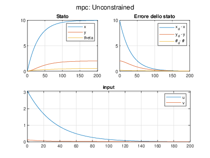

# System Theory Project

This repository contains the implementation of a project for the **System Theory** course. The project focuses on a **mobile robot** with the goal of implementing a **state observer** and a **Model Predictive Controller (MPC)** to move the system from an initial state to a desired target state.

---

## Table of Contents
1. [Project Description](#project-description)
2. [System Dynamics](#system-dynamics)
3. [State Observation](#state-observation)
4. [Control (MPC)](#control-mpc)
5. [Examples](#examples)

---

## Project Description

The aim of the project is to design a control system for a mobile robot. The robot is tasked with moving from an initial state $\mathbf{x} = [0, 0, 0]^T$ to a desired state defined as:
```math
\begin{dcases}
x_d = 10 \\
y_d = 2 \\
\theta_d = \text{atan2}(y_d - y, x_d - x)
\end{dcases}
```
The project involves:
- Designing an **Extended Kalman Filter (EKF)** for state observation.
- Implementing a **Model Predictive Controller (MPC)** to achieve the desired behavior.

---

## System Dynamics

### Robot Model
The robot's structure and model variables are illustrated in the following diagram:


### Equations
1. **Point to Control**:
    ```math
    \begin{dcases}
    x = x' + \delta \cos(\theta) \\
    y = y' + \delta \sin(\theta)
    \end{dcases}
    ```

2. **Dynamics**:
    ```math
    \begin{dcases}
    \dot{x} = v \cos(\theta) - \delta \omega \sin(\theta) \\
    \dot{y} = v \sin(\theta) + \delta \omega \cos(\theta) \\
    \dot{\theta} = \omega
    \end{dcases}
    ```

3. **Measured Output**:
    ```math
    \begin{dcases}
    x_m = x' - \alpha \cos(\theta) \\
    y_m = y' + \alpha \sin(\theta) \\
    \theta_m = \theta
    \end{dcases}
    ```

---

## State Observation

### Extended Kalman Filter (EKF)
An **Extended Kalman Filter** was implemented to handle the nonlinearity of the system. The process involves:
1. **Linearization and Discretization** of the system using:
    ```matlab
    [A, B, C] = linearize(x_hats(:,i), u(:,i), delta, alfa, T);
    ```
2. **Dynamic Simulation**:
    ```matlab
    if (i < N)
        x(1,i+1) = x(1,i) + T * (u(1,i) * cos(x(3,i)) - delta * u(2,i) * sin(x(3,i)));
        x(2,i+1) = x(2,i) + T * (u(1,i) * sin(x(3,i)) + delta * u(2,i) * cos(x(3,i)));
        x(3,i+1) = x(3,i) + T * u(2,i);
    end
    y(1,i) = x(1,i) - delta * cos(x(3,i)) - alfa * cos(x(3,i));
    y(2,i) = x(2,i) - delta * sin(x(3,i)) - alfa * sin(x(3,i));
    y(3,i) = x(3,i);
    ```
3. **Kalman Gain Calculation**:
    ```matlab
    K = Ps * C' * (R_v + C * Ps * C')^-1;
    ```
4. **Time Update Equations**:
    ```matlab
    x_hats(1,i+1) = x_hat(1,i) + T * (u(1,i) * cos(x_hat(3,i)) - delta * u(2,i) * sin(x_hat(3,i)));
    ```

---

## Control (MPC)

The system control was implemented using a **Model Predictive Controller (MPC)**. The control state is defined as the error:
$$
\mathbf{e} = \mathbf{x}_d - \mathbf{x}
$$

### Modes of Operation
Three types of predictive control were implemented:
1. **LQR**
2. **Unconstrained**
3. **Constrained**, with the following constraints:
    ```math
    \begin{dcases}
    |v| < 0.5 \, \text{m/s} \\
    |\omega| < 0.3 \, \text{rad/s}
    \end{dcases}
    ```

### Implementation
The control law was implemented as follows:
```matlab
if (control_mode == 0)
    u(:,i) = my_mpc(A, -B, eye(3,3), e(:,i), S0.Q, S0.S);
elseif (control_mode == 1)
    u(:,i) = my_mpc(A, -B, eye(3,3), e(:,i), S0.Q, S0.S, S0.N_stop, S0.P);
elseif (control_mode == 2)  
    u(:,i) = my_mpc(A, -B, eye(3,3), e(:,i), S0.Q, S0.S, S0.N_stop, S0.P, u_min, u_max);
end
```

---

## Examples

### Kalman Filter Example
The following figure illustrates the results of the Kalman Filter with test inputs such as a step function for $v$ and $\omega$:


### MPC Modes
#### 1. **LQR Mode**:


#### 2. **Unconstrained Mode**:


#### 3. **Constrained Mode**:

